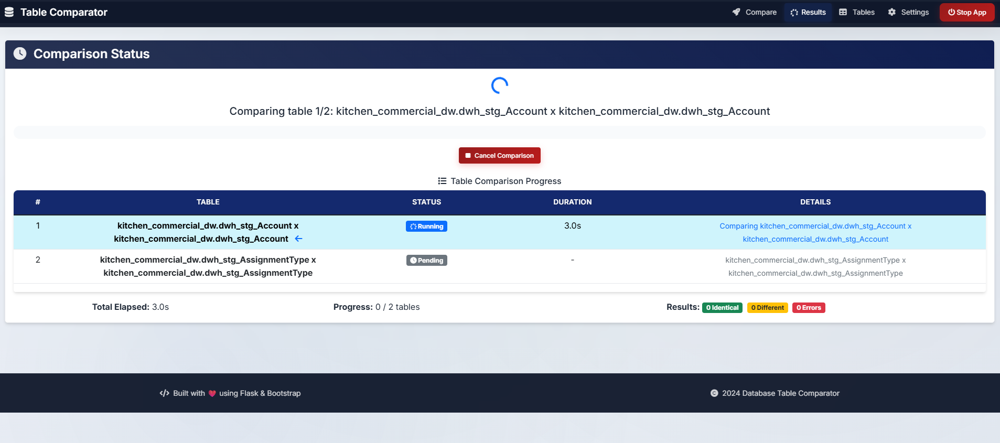
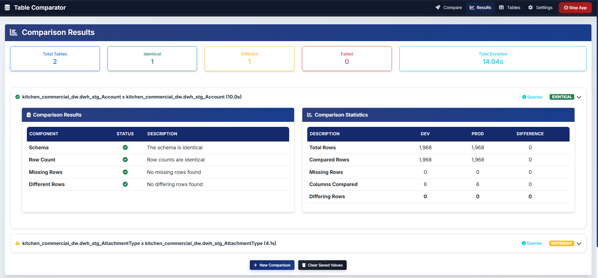
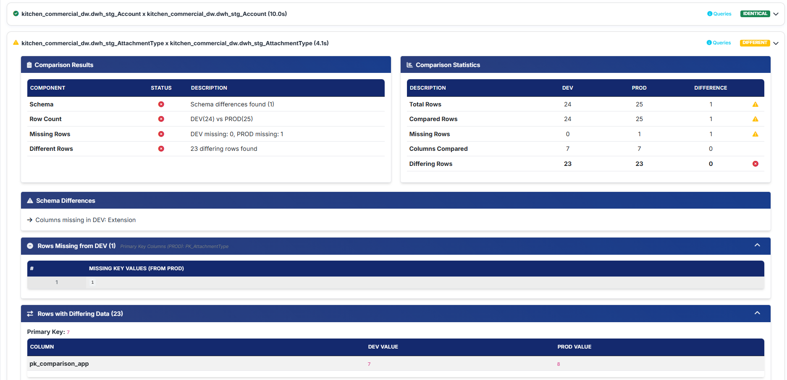

# 🚀 Databricks Table Comparator


**A robust Data Engineering tool to validate environment parity and automate Quality Assurance between Development and Production Databricks environments.**

This application allows Data Analysts and Engineers to quickly identify schema drifts, row count mismatches, and data discrepancies without writing complex ad-hoc queries manually.

---

## 📸 Preview

## Comparing Table Resuls...


## Identical Results


## Differences Found


---

## ✨ Key Features

* **📊 Schema Comparison**: Validates table structure parity, checking for column count mismatches, missing column names, and data type differences between environments.
* **🔢 Row Count Analysis**: Instantly compares the total number of records in each table to detect major volume discrepancies.
* **🚫 Missing Rows Detection**: Identifies specific records (based on Primary Keys) that exist in one environment but are missing in the other (e.g., "Missing from PROD").
* **≠ Data Discrepancy Check**: Pinpoints rows that exist in both tables but contain conflicting values in specific columns, highlighting the exact differences.
* **⚡ Smart Sampling**: Supports `LAST N` sampling to handle large datasets efficiently.

---

## ⚙️ How to Run

### Prerequisites
* Python 3.11+
* Access to Databricks SQL Warehouses (DEV and PROD)

### 1. Clone the repository
```bash
git clone https://github.com/RenatoMoratti/table-comparator
cd table-comparator
```

### 2. Setup Virtual Environment
```bash
# Windows
python -m venv .venv
.\.venv\Scripts\Activate.ps1

# Linux/macOS
python3 -m venv .venv
source .venv/bin/activate
```

### 3. Install Dependencies
```bash
pip install -r requirements.txt
```

### 4. Run the Application
```bash
python app.py
```
Access the tool at http://127.0.0.1:5000

## 📖 Usage Guide

* **Configuration**: Go to the Settings page and configure your Databricks Host, Warehouse ID, and Token for both DEV and PROD environments.
* Note: Credentials are saved securely in your OS Keyring, not in the project files.
* **Manage Tables**: Register the tables you frequently compare in the Tables menu to auto-fill configurations later.
* **Compare**: Select the tables, define Primary Keys, and choose columns to ignore (e.g., ingestion_timestamp).

## ⚖️ Scalability & Performance Note

This tool is designed for **Data Quality Sampling** and **Validation**. It pulls data into the application layer (Pandas) to perform detailed diffing.

* **For massive datasets (TB/PB)**: It is recommended to use the built-in **"Max Rows Limit"** feature (e.g., compare the last 10,000 rows) to verify pipeline logic without fetching the entire table.
* **Full Data Volume**: For full-scan comparisons of billion-row tables, a native Spark Job using EXCEPT / MINUS SQL logic directly on the cluster is recommended over this tool.